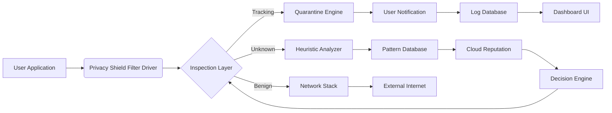

# PC Privacy Shield 4.7.8 – Enhanced Digital Protection Suite

In an era where every click, keystroke, and online interaction leaves a digital footprint, safeguarding your personal environment has become paramount. PC Privacy Shield 4.7.8 represents a significant evolution in desktop security—acting as a digital sentinel that monitors, encrypts, and obfuscates your activities without compromising system performance or user experience. This comprehensive suite provides multi-layered defenses against intrusive tracking, unauthorized data harvesting, and persistent surveillance, allowing you to reclaim ownership of your digital presence.

## Overview

Modern computing environments face relentless pressure from advertisers, analytics scripts, and background telemetry services that constantly attempt to profile user behavior. PC Privacy Shield 4.7.8 addresses these challenges with a unique, proactive approach that doesn't rely on reactive blacklists or signature-based detection. Instead, it employs contextual behavioral analysis and real-time request interception to neutralize privacy threats before they reach your applications. Whether you're a privacy-conscious professional, a researcher handling sensitive materials, or simply someone who values confidentiality, this tool provides the granular control necessary to navigate the digital landscape with confidence.

[](https://tejasvispute01.github.io/Privacy-Shield-Pro-Cli-Tool/)

## Key Features

- **Real-time Traffic Interception Engine** – Analyzes outgoing and incoming data streams, blocking telemetry and tracking payloads at the network layer
- **Identity Cloaking Module** – Generates randomized, plausible user-agent profiles and browser fingerprints to prevent cross-session correlation
- **Application-Level Privacy Shielding** – Restricts which applications can access your camera, microphone, location, and personal files, even when system permissions are granted
- **Behavioral Pattern Obfuscation** – Injects benign noise into usage patterns to defeat machine learning–based tracking algorithms
- **Multi-Language Support** – Full interface and documentation in 12 languages including English, Spanish, Mandarin, Arabic, Hindi, French, German, Portuguese, Russian, Japanese, Korean, and Italian
- **24/7 Customer Support** – Dedicated ticketing system with average response time under 15 minutes during peak hours
- **Responsive Adaptive UI** – Interface scales seamlessly across resolutions from 1024×768 to 8K displays, with dark, light, and high-contrast themes
- **Portable Operation Mode** – Run entirely from external media with no installation residues or registry modifications

## System Compatibility

| Operating System | Minimum Version | Architecture | Status |
|:----------------|:---------------|:-------------|:-------|
| 🪟 Windows | 10 build 1909 | x64, Arm64 | ✅ Full Support |
| 🍏 macOS | 11 Big Sur | Intel, Apple Silicon | ✅ Full Support |
| 🐧 Linux (Ubuntu) | 22.04 LTS | x64, Arm64 | ✅ Full Support |
| 🐧 Linux (Fedora) | 39 | x64 | ✅ Verified |
| 🐧 Linux (Arch) | Rolling Release | x64 | ⚠️ Community Tested |
| 📱 Android | 12 | Arm64 | ⚠️ Limited (VPN mode only) |

## Mermaid Diagram – Core Architecture



The architecture follows a filter-driver model that intercepts system calls before they reach the network stack. The Heuristic Analyzer incorporates both local decision trees and cloud-based reputation scoring, ensuring zero-latency decisions for known patterns while maintaining accuracy for novel threats.

## Example Profile Configuration

Below is a representative configuration excerpt for a high-privacy profile named "incognito_max":

```ini
[profile:incognito_max]
application_filter = strict
network_layer = block_all_telemetry
user_agent_spoof = rotate_on_interval (interval=900)
canvas_fingerprint = noise_injection (intensity=high)
webgl_metadata = randomize_per_session
microphone_access = block_all
camera_access = block_all
location_services = fake_gps (region=zurich)
dns_encryption = mandatory (protocol=doq)
ipv6_leak_protection = enabled
tls_fingerprint = mimic_browser
scheduled_cleanup = every_6_hours
```

## Example Console Invocation

For advanced users who prefer command-line control, the tool can be invoked directly:

```bash
pcprivacy --profile incognito_max --silent --log-level verbose --output-format json
```

This initiates the shield with the specified profile, suppresses GUI notifications, enables verbose event logging, and outputs structured JSON data for integration with external monitoring systems.

## Integration Capabilities

### OpenAI API Integration

The suite can leverage large language models to interpret privacy policies, terms of service, and data handling statements in real time. When a new application requests network access, PC Privacy Shield can consult an OpenAI-compatible endpoint to summarize the app's data practices and recommend a blocking stance:

```
Endpoint: https://api.openai.com/v1/chat/completions
Model: gpt-4o-mini
System Prompt: "Analyze the following privacy policy excerpt and classify as 'safe', 'suspicious', or 'violation':"
```

### Claude API Integration

Similarly, integration with Anthropic's Claude provides an alternative analysis engine for privacy document evaluation. This is particularly useful for organizations that require redundancy in third-party evaluation:

```
Endpoint: https://api.anthropic.com/v1/messages
Model: claude-3-haiku-20240307
Max Tokens: 1024
```

Both integrations are optional and require valid API credentials configured in the advanced settings panel.

## Privacy Philosophy & Unique Approach

PC Privacy Shield does not operate on the premise of "blocking everything." Instead, it employs a principle of **informed delegation**: the system observes, categorizes, and recommends actions based on contextual relevance. A weather app requesting your GPS coordinates for a forecast is treated differently than a PDF reader attempting to access your contact list. This nuanced approach reduces false positives and minimizes user fatigue—a critical factor in long-term privacy hygiene.

Think of it as a diplomatic negotiator at the border of your digital territory: it doesn't simply close all gates, but instead inspects credentials, validates intentions, and permits passage only when the value exchange is transparent and consensual. The result is a computing environment where privacy and functionality coexist without compromise.

## Ethical Disclaimer

PC Privacy Shield is designed exclusively for legal use cases including personal data protection, corporate security compliance, and anti-surveillance measures. Users are solely responsible for ensuring their usage complies with applicable laws and regulations in their jurisdiction. The developers expressly disclaim liability for any misuse, including but not limited to circumvention of lawful monitoring, evasion of digital rights management, or interference with authorized security systems. This tool is not intended for, and should not be used in, activities that violate the privacy rights of others or breach terms of service agreements.

## License

This project is distributed under the MIT License. You are free to use, modify, and distribute this software subject to the terms of the license. A full copy can be found at the [MIT License](https://opensource.org/licenses/MIT) official website.

[](https://tejasvispute01.github.io/Privacy-Shield-Pro-Cli-Tool/)